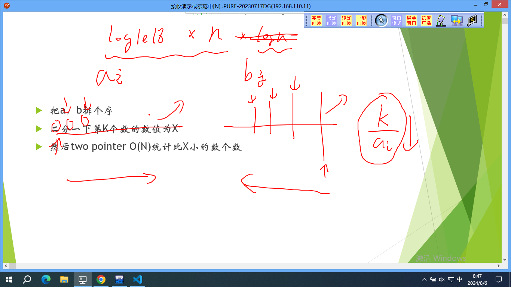
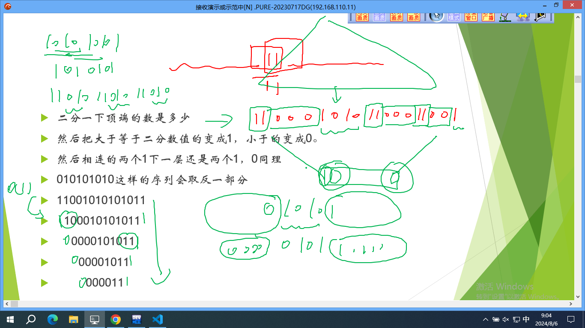
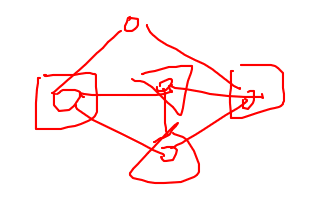
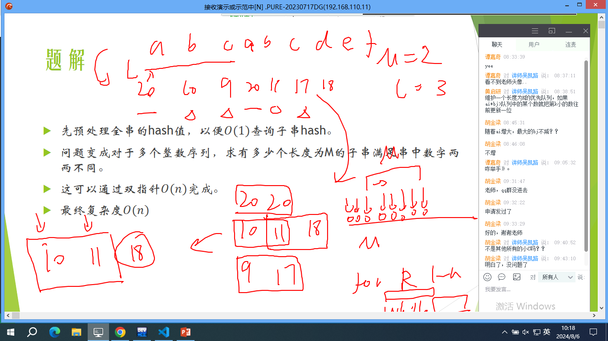
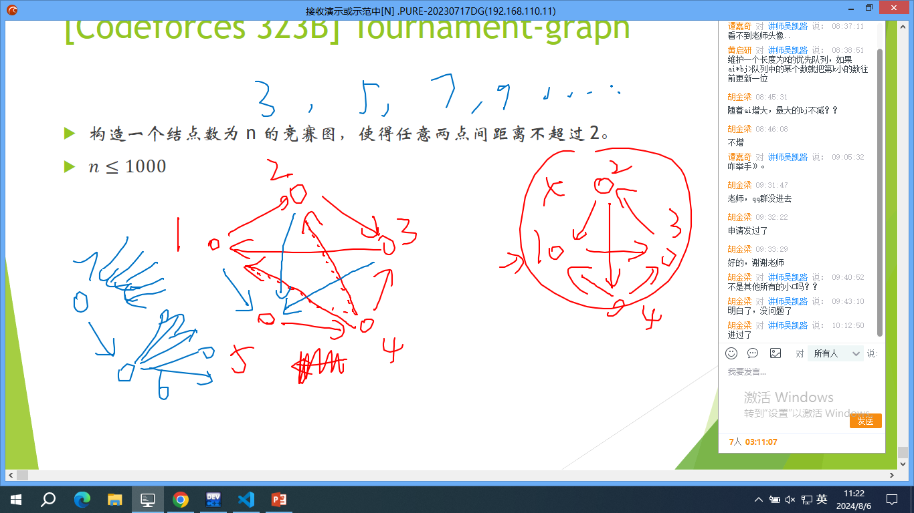
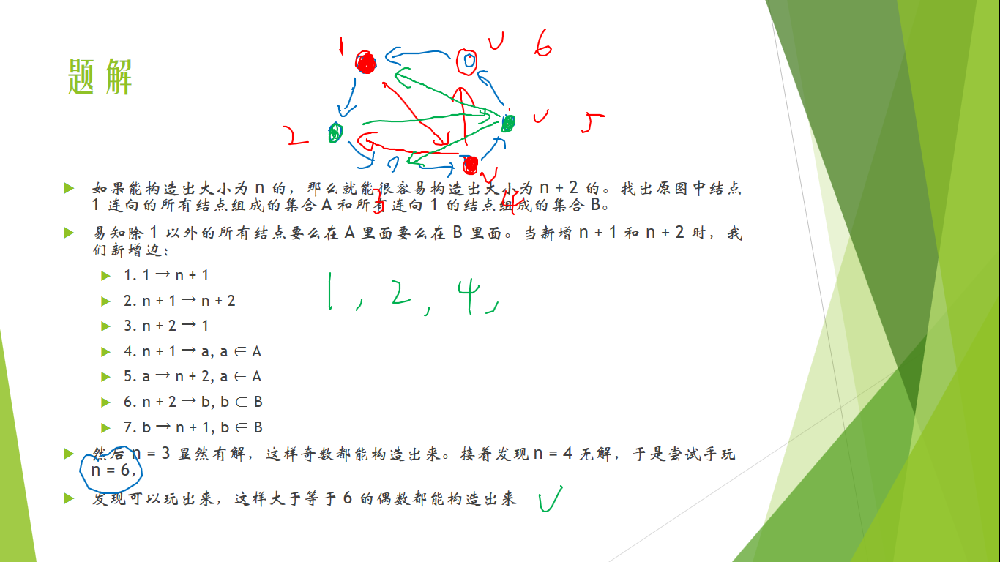
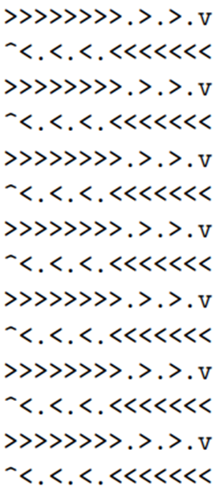
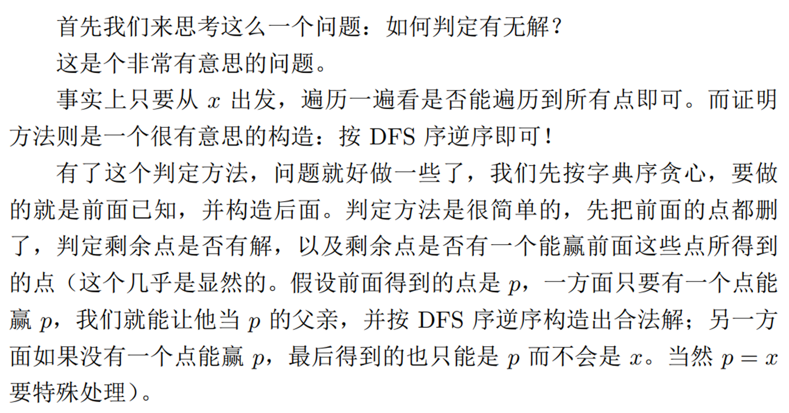

# 数据结构

| key | value |
| --- | --- |
| 授课教师 | 吴凯路（NOIP2017金） |
| 教师简介 | ikun, 原, homo, 三体 |
| 日期 | 2024/8/6 |

#### 语录：
- “这就搞完了嘛”
- “我是0，另外一个是1”
- “你是0，他是1是吧”
- “原题是开inparty”

## 引入

### 简单题1
  
思路一、**二分**，每次猜一个$k$，然后双指针，$a = a_i, b = \frac{k}{b_i}$  
思路二、（性质）$\frac{k}{a}$ 向下取整只有 $\sqrt{n}$ 种可能性，利用sqrt(n)的性质

### 简单题2

**主席树求第$k$大**  
**二分**顶端的数，大于等于二分数值的记为1，否则记为0  
性质：
- 01交替串：下一层取反
- 连续1：下层必为1
- 连续0：下层必为0

维护：
不使用线段树（没用）
预处理1111，0000串，01交替串反复横跳，在产生影响是再考虑
每次处理最左边和最右边

时间复杂度：$O(nlogn)$

### 简单题3

复杂度判断：2s，1e5，大概率带有两个logn
二分（带log）
线段树（带log）
- 区间查询1的个数
- 区间赋值为0/1

## 01分数规划 -- 二分+状态压缩
- 特征：
  你有$N$个物品，如果你选择第$i$个物品则$X_i=1$,否则为$0$。你的选择可能有一些不同的限制。  
  定义$F(X)$表示方案X下你的收益，$G(X)$表示方案$X$下你的代价。$F$和$G$都是关于$X$的线性函数。  
  最大化 $R(X) = \frac{F(X)}{G(x)}$
- 解法：
  二分答案
  $$
  \begin{aligned}
    \frac{F(X)}{G(X)} &\geqslant y \\
    F(X) &\geqslant y*G(X) \\
    F(X)-y*G(X) &\geqslant 0 
  \end{aligned}
  $$
  二分一个$y$，`check`函数中验证$F-y*G \geqslant 0$即可

### 简单题4
二分平均值，然后每条边减去平均值，问题变为查找是否存在正环。  
_可以使用SPFA_，避免使用SPFA，会有数据卡SPFA

## Hash算法

### [BZOJ 4264]小C找朋友
- 感性理解：与其他所有人的关系一致
- 样例：  
    
  图中有两对（方框和三角）
- 菊花图：  
    
  除根节点外，其他两两一对都是好基友
- 做法：
  列出01矩阵，对于每一行进行哈希，看有多少个相同即可  
  > 01矩阵为$G$，若$G_{i, j} = 1$，则表示i与j有连边
    若$G_{i, j} = 0$，则表示i与j无连边
  
  使用双模数哈希

### [BZOJ 3098] Hash Killer II
经典例题，提交答案题

> **生日悖论**  
  如果一个房间里有 $23$ 个或 $23$ 个以上的人，那么至少有两个人的生日相同的概率要大于 $50%$  
  4.8

所以只要有超过$\sqrt{2Mod}$以上的不同子串，就有超过$50%$的概率卡掉该算法。

### 不同字串个数
HashKiller2里面使用进制哈希实现，我们如何正确实现？

**滑动窗口**：对于串$X = abcb, n = 4, L = 3$
- 对于$abc$，设哈希值为$Hash(X_{1,3} = abc) = a*114^2 + b*114^1 + c*114^0$（$114$是~~homo~~自行挑选的基数）
- 再算$bcb$，减去$a*114^2$（开头的字符哈希值），乘$114$（整体进位），加上$b*114^0$（尾部的字符哈希值）即可。即：
  $$
    \begin{aligned}
        &Hash(X_{2,4} = bcb) = \\
        &(Hash(X_{1,3} = abc) - a*114^2)*114 + b*114^0 = \\
        &b*114^2 + c*114^1 + b*114^0
    \end{aligned}
  $$

### [HDU 4821] String
维护哈希表，检查冲突  
  
如果后面加入的与前面的产生冲突，就弹出

## 数论

### [51nod 1678] lyk与gcd
**结论**：一个数的因数个数不超过$\sqrt{N}$  
统计为$i$的倍数的所有下标位置的值之和。令这个数组为$f$。
$$\frac{n}{1} + \frac{n}{2} + \frac{n}{3} + ... + \frac{n}{n} \approx nlogn$$
对于修改$a_i$操作，只需要修改$i$的所有因数位置的$f$即可。  
对于查询操作，进行容斥，`+`有一个质因数相同的，`-`有两个质因数相同的，`+`有三个质因数相同的……  
总复杂度$O(N1.5)$
_还可以使用`莫比乌斯函数`，`线性筛`_

## 数据结构

### [51nod 1495]中国好区间
1. 暴力$O(n^3)$ $\rightarrow$ 滑动窗口优化
2. 二分比T大的和小的，将序列变成01序列  
  枚举区间，与k比较大小，得到$O(n^2)$
3. 逐个枚举区间开头，去找结尾，双指针
  对于这一类“统计是否比某个数大的数个数”问题，通常可以把大于等于这个数的数字看出1，小于的看成0。  
  原问题等于统计和大于K的区间有多少个。  
  使用双指针O(N)解决。
  

## 构造

### [Codeforces 306D] Cow Tennis Tournament
可能会无解且显然$n \leqslant 4$是无解的  
显然如果知道了边长那么我们就确定了这个多边形的形状，所以只用考虑边长。我们可以让前 $n − 2$ 条边中第 $i$ 条边的边长为 $500 + 0.01 * i$，然后最后两条边凑一下长度使得恰好能使多边形封闭。
其余情况使用这样子的构造可以保证 $n \leqslant 100$ 的正确性。

### [Codeforces 317C] Balance
稠密图，注意容器有最大容积  
只需要考虑一颗生成树，然后每次完成叶子节点即可

### [Codeforces 323B] Tournament-graph

如果能构造出大小为 $n$ 的，那么就能很容易构造出大小为 $n + 2$ 的。找出原图中结点 $1$ 连向的所有结点组成的集合 $A$ 和所有连向 $1$ 的结点组成的集合 $B$。
易知除 $1$ 以外的所有结点要么在 $A$ 里面要么在 $B$ 里面。当新增 $n + 1$ 和 $n + 2$ 时，我们新增边：
1. $1 \rightarrow n + 1$
2. $n + 1 \rightarrow n + 2$
3. $n + 2 \rightarrow 1$
4. $n + 1 \rightarrow a, a \in A$
5. $a \rightarrow n + 2, a \in A$
6. $n + 2 \rightarrow b, b \in B$
7. $b \rightarrow n + 1, b \in B$

然后 $n = 3$ 显然有解，这样奇数都能构造出来。接着发现 $n = 4$ 无解，于是尝试手玩 $n = 6$，  
  
发现可以玩出来，这样大于等于 $6$ 的偶数都能构造出来

### [Codeforces 333C] [Lucky Tickets](https://codeforces.com/problemset/problem/333/C)
暴力枚举每个 $4$ 位数字串能得到的所有可能结果 $r$，然后前 $4$ 位给这个数字串，后 $4$ 位是$n + r$。如果 $n + r$ 不是不超过 $4$ 位的整数就不管。可以发现即使舍掉了超出范围的数，方案数也仍然是非常多的，于是就能过了。

### [Codeforces 329D] The Evil Temple and the Moving Rocks
上一层撞完了会激活下一层，而每层都会产生至少 $(\frac{n}{2})^2 - (\frac{n}{2})$个撞击声。  

### [GCJ WF 2014 D] Paradox Sort

## 其他

### [LimitedMemorySeries1](https://vjudge.net/problem/TopCoder-14088)
- 整体二分：$O(100 * 5e6 * log(5e6)) = TLE$
- 值域分块：$O(const * 5e6) = AC$

### LimitedMemorySeries2
- Subtask1: 简单递推
- Subtask2:
  —— “答案总和不超过$NlogN$”
  —— “这种数据生成方式下更小”
  —— “暴力!”
  —— “空间怎么办？”
  —— “$X_{i-1}=((X_i+250−b) ^a) AND (250−1)$”
  —— “能过？”
  —— “缓存友好”

### XorSequence
从高位往低位贪心即可

### HatParade
我们可以推测出每个数的前缀和后缀和对应的是什么。  
我们知道开头，结尾。  
看上去方案只有一种,但是可以对称，对调。所以答案是2的整次幂。  
统计一下可以对调的组数就可以了。  
可以$O(N^2)$或者$O(NlogN)$实现。

# XzyStudio
<iframe style="width:100%;height: 80vh;border:1px solid grey;" src="https://xzynb.top">
  不支持iframe标签
</iframe>
