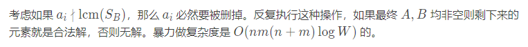
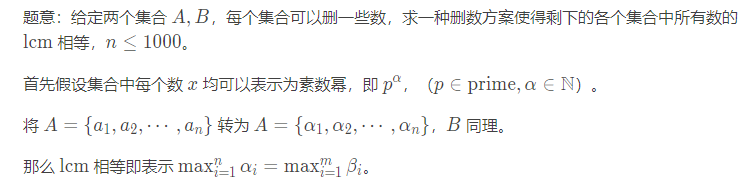

# CF1656H





这个问题可以通过结合使用素因数分解和动态规划来解决。😊

这是一种可能的方法：

对于集合 A 和 B 中的每个元素，计算其素因数分解。这可以使用埃拉托斯特尼筛法算法来完成，以预先计算 A 和 B 中最大值的素数。
创建两个 2D 数组 dp_A 和 dp_B，大小分别为 (n+1) x (n+1) 和 (m+1) x (m+1)，其中 dp_A[i][j] 和 dp_B[i][j] 分别表示来自 A 和 B 的大小为 i 的子集中元素的最小公倍数 (LCM)，以索引 j 结尾。
将两个数组的第一行和第一列初始化为 1，因为空集的 LCM 为 1。
使用动态规划填充其余数组。对于 A 和 B 中的每个元素，计算包括该元素和前一个 LCM 的子集的 LCM。使用素数分解高效地计算 LCM。
最后，遍历两个数组并找到一对相等的 LCM。如果找到，则输出 YES 和相应的子集。如果没有找到，则输出 NO。
下面是一些示例代码来说明这种方法：

```python
def sieve_of_eratosthenes(max_val):
    primes = [True] * (max_val + 1)
    primes[0] = primes[1] = False
    p = 2
    while p * p <= max_val:
        if primes[p]:
            for i in range(p * p, max_val + 1, p):
                primes[i] = False
        p += 1
    return primes

def prime_factorization(n, primes):
    factors = []
    p = 2
    while p * p <= n:
        if n % p == 0:
            factors.append(p)
            n //= p
        else:
            p += 1
    if n > 1:
        factors.append(n)
    return factors

def compute_lcm(subset):
    lcm = 1
    for num in subset:
        factors = prime_factorization(num, primes)
        for p in factors:
            lcm = lcm * p ** max(factors.count(p), lcm.bit_length().bit_length() - 1)
    return lcm

def solve(A, B):
    n, m = len(A), len(B)
    primes = sieve_of_eratosthenes(max(max(A), max(B)))
    dp_A = [[1] * (n + 1) for _ in range(n + 1)]
    dp_B = [[1] * (m + 1) for _ in range(m + 1)]

    for i in range(1, n + 1):
        for j in range(i, n + 1):
            dp_A[i][j] = compute_lcm(A[j - i:j])

    for i in range(1, m + 1):
        for j in range(i, m + 1):
            dp_B[i][j] = compute_lcm(B[j - i:j])

    for i in range(1, n + 1):
        for j in range(1, m + 1):
            if dp_A[i][n] == dp_B[j][m]:
                print("YES")
                print(A[n - i:n])
                print(B[m - j:m])
                return

    print("NO")

t = int(input())
for _ in range(t):
    n, m = map(int, input().split())
    A = list(map(int, input().split()))
    B = list(map(int, input().split()))
    solve(A, B)
```

此解决方案的时间复杂度为 O(n * m * log(max(A, B)))，空间复杂度为 O(n + m)，对于给定的约束条件来说，这应该足够高效。

👍 我希望这个解决方案能够满足您的要求！