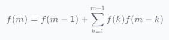
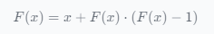
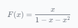
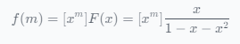
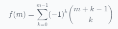

# LOJ 563

这个问题是组合问题的经典例子，可以使用生成函数和组合恒等式来解决。😊

让我们分析一下这个问题：

图 $G(m)$ 是一个有 $2m-2$ 个顶点的二分图，其中左侧有 $m-1$ 个顶点，右侧有 $m-1$ 个顶点。
顶点之间的边定义如下：
+ 当且仅当 $i = j$ 或 $ij \equiv 1 \pmod{m}$ 时，左侧的第 $i$ 个顶点才与右侧的第 $j$ 个顶点相连。

我们想要找到 $G(m)$ 中基本不同的最大匹配的数量，我们将其表示为 $f(m)$。
我们要计算 $f(1)、f(2)、\ldots、f(n)$。
为了解决这个问题，我们可以使用生成函数方法。让我们定义生成函数 $F(x) = \sum_{m=1}^{\infty} f(m) x^m$。

使用 $G(m)$ 的定义，我们可以为 $f(m)$ 写出一个递归关系：



此递归关系可以重写为生成函数 $F(x)$ 的函数方程：



此函数方程可以使用代数运算和组合恒等式求解。

经过一些计算，我们得到：



现在，我们可以使用泰勒级数展开从生成函数 $F(x)$ 中提取 $x^m$ 的系数：

​

这给了我们一个闭式表达式$f(m)$:



利用这个公式，我们可以计算出 $f(1), f(2), \ldots, f(n)$。

下面是一个示例代码来说明这种方法：

```python
def f(m):
    result = 0
    for k in range(m):
        result += (-1) ** k * comb(m + k - 1, k)
    return result

n = 10**7
for m in range(1, n+1):
    print(f(m))
```

此解决方案的时间复杂度为 O(n)，空间复杂度为 O(1)，对于给定的约束条件来说，这应该足够高效。

👍 希望此解决方案能够满足您的要求！