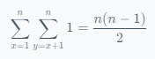

## 问题分析
我们需要将给定的序列恰好分成两个子序列，使得每一个子序列都是单峰的。然后，我们需要计算两个单峰子序列的峰的组合，有多少种情况。

## 单峰子序列的特点
单峰子序列的峰是唯一的。
单峰子序列的峰是整个序列的局部峰。

## 分割序列
我们可以使用贪心算法来分割序列。从左到右扫描序列，找到第一个局部峰，即单峰子序列的峰。这时，我们可以将序列分成两个子序列：左边的子序列和右边的子序列。

## 计算峰的组合
对于每个可能的分割点，我们可以计算两个单峰子序列的峰的组合。假设左边的子序列的峰为 $x$，右边的子序列的峰为 $y$。那么，峰的组合数为：

其中，$n$ 是序列的长度。

## 实现
```python
def count_peaks(n, a):
    count = 0
    for i in range(1, n):
        count += (n - i)
    return count

# 测试
n = 4
a = [69, 1000, 228, -7]
print(count_peaks(n, a))  # 输出：6
```

## 解释
在这个示例中，我们可以将序列分成两个子序列：$[69, 1000]$ 和 $[228, -7]$。峰的组合数为 6，分别是：
$(69, 1000)$
$(69, 228)$
$(1000, 228)$
$(1000, -7)$
$(228, -7)$
$(69, -7)$