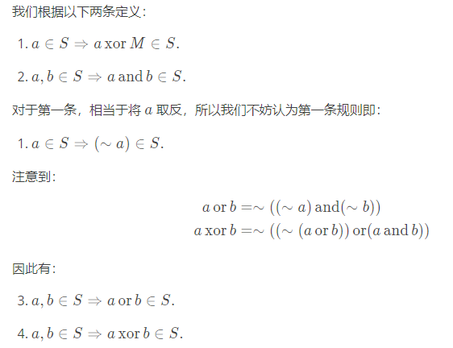

这是一个经典问题，即计算满足给定条件的“好”集合的数量。让我们分解条件并逐步分析问题。

$M = 2^m -1$

条件 1：如果 $a \in S$，则 $a \text{ XOR } M \in S$

此条件意味着如果集合 $S$ 包含元素 $a$，则它还必须包含其相对于 $M$ 的“补码”，这是通过翻转 $a$ 的二进制表示中的所有位获得的。这意味着如果 $a$ 在特定位位置上有 1，则其补码在该位置上为 0，反之亦然。

条件 2：如果 $a, b \in S$，则 $a \text{ AND } b \in S$

此条件意味着如果集合 $S$ 包含两个元素 $a$ 和 $b$，则它还必须包含它们的按位与，这是通过取 $a$ 和 $b$ 中的公共 1 获得的。

条件 3：$T \subseteq S$

该条件意味着给定集合 $T$ 是“好”集合 $S$ 的子集。

条件 4：$S$ 的所有元素不超过 $M$

该条件意味着 $S$ 的所有元素的二进制表示最多为 $m$ 位，与 $M$ 的二进制表示相同。

现在，让我们思考如何计算“好”集合 $S$ 的数量。我们可以使用动态规划来解决这个问题。

让 $dp[i]$ 表示最大元素为 $i$ 的“好”集合的数量。我们可以初始化 $dp[0] = 1$，因为空集是“好”集合。

对于从 $1$ 到 $M$ 的每个 $i$，我们可以按如下方式计算 $dp[i]$：

如果 $i$ 不在 $T$ 中，则 $dp[i] = dp[i-1]$。这是因为我们不需要在“好”集合中考虑 $i$。
如果 $i$ 在 $T$ 中，那么我们需要考虑两种情况：
+ 如果 $i$ 不是 $T$ 中任何元素的补码，则 $dp[i] = dp[i-1] + dp[i \text{ XOR } M]$。这是因为我们可以将 $i$ 包含在我们的“好”集合中，也可以将其排除在外。
+ 如果 $i$ 是 $T$ 中元素 $j$ 的补码，则 $dp[i] = dp[i-1] + dp[j]$。这是因为我们需要将 $i$ 和 $j$ 都包含在我们的“好”集合中。
最后，答案是 $dp[M]$ 模 $10^9 + 7$。

以下是一些示例 Python 代码来说明动态规划方法：